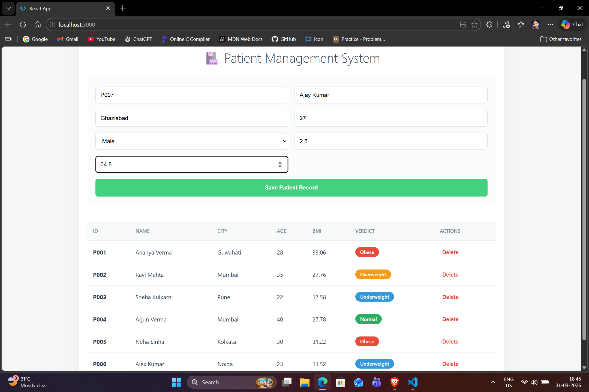

🏥 Patient Management System
A full-stack web application designed to manage patient records, calculate BMI automatically, and provide health verdicts. Built with a FastAPI backend and a React frontend.

# 🏥 Patient Management System

🚀 Features
Automated BMI Calculation: Automatically calculates BMI based on height and weight.
Health Verdicts: Provides instant status (Underweight, Normal, Overweight, Obese).
CRUD Operations: Create, View, and Delete patient records seamlessly.
Persistent Storage: Data is saved locally in a JSON format to ensure it persists after restarts.
Responsive UI: Modern dashboard design with color-coded health badges.

🛠️ Tech Stack
Frontend: React.js, Axios, CSS3.
Backend: FastAPI (Python 3.13), Uvicorn.
Data Handling: Pydantic models for validation.

📂 Project Structure
Plaintext
patient-record-management-system/
├── backend/
│   ├── main.py            # FastAPI application logic
│   └── patients.json      # Local JSON database
├── frontend/
│   ├── src/
│   │   ├── App.js         # Main React component
│   │   └── App.css        # Dashboard styling
│   └── package.json       # Frontend dependencies
└── screenshot.png         # Project preview

⚙️ Setup Instructions
1. Backend Setup
Navigate to the backend folder and start the FastAPI server:

Bash
cd backend
# Install dependencies if needed (fastapi, uvicorn)
uvicorn main:app --reload
The backend will run at http://127.0.0.1:8000.

Gemini said
Since you've reorganized your project into a clean frontend and backend structure, a professional README will help others (and your future self) understand how to run it.

Here is a complete, well-formatted README.md file you can use. You can place this in the root of your patient-record-management-system folder.

🏥 Patient Management System
A full-stack web application designed to manage patient records, calculate BMI automatically, and provide health verdicts. Built with a FastAPI backend and a React frontend.

🚀 Features
Automated BMI Calculation: Automatically calculates BMI based on height and weight.

Health Verdicts: Provides instant status (Underweight, Normal, Overweight, Obese).

CRUD Operations: Create, View, and Delete patient records seamlessly.

Persistent Storage: Data is saved locally in a JSON format to ensure it persists after restarts.

Responsive UI: Modern dashboard design with color-coded health badges.

🛠️ Tech Stack
Frontend: React.js, Axios, CSS3.

Backend: FastAPI (Python 3.13), Uvicorn.

Data Handling: Pydantic models for validation.

📂 Project Structure
Plaintext
patient-record-management-system/
├── backend/
│   ├── main.py            # FastAPI application logic
│   └── patients.json      # Local JSON database
├── frontend/
│   ├── src/
│   │   ├── App.js         # Main React component
│   │   └── App.css        # Dashboard styling
│   └── package.json       # Frontend dependencies
└── screenshot.png         # Project preview
⚙️ Setup Instructions
1. Backend Setup
Navigate to the backend folder and start the FastAPI server:

Bash
cd backend
# Install dependencies if needed (fastapi, uvicorn)
uvicorn main:app --reload
The backend will run at http://127.0.0.1:8000.

2. Frontend Setup
Open a new terminal, navigate to the frontend folder, and start the React app:

Bash
cd frontend
npm install
npm start
The frontend will run at http://localhost:3000.

Gemini said
Since you've reorganized your project into a clean frontend and backend structure, a professional README will help others (and your future self) understand how to run it.

Here is a complete, well-formatted README.md file you can use. You can place this in the root of your patient-record-management-system folder.

🏥 Patient Management System
A full-stack web application designed to manage patient records, calculate BMI automatically, and provide health verdicts. Built with a FastAPI backend and a React frontend.

🚀 Features
Automated BMI Calculation: Automatically calculates BMI based on height and weight.

Health Verdicts: Provides instant status (Underweight, Normal, Overweight, Obese).

CRUD Operations: Create, View, and Delete patient records seamlessly.

Persistent Storage: Data is saved locally in a JSON format to ensure it persists after restarts.

Responsive UI: Modern dashboard design with color-coded health badges.

🛠️ Tech Stack
Frontend: React.js, Axios, CSS3.

Backend: FastAPI (Python 3.13), Uvicorn.

Data Handling: Pydantic models for validation.

📂 Project Structure
Plaintext
patient-record-management-system/
├── backend/
│   ├── main.py            # FastAPI application logic
│   └── patients.json      # Local JSON database
├── frontend/
│   ├── src/
│   │   ├── App.js         # Main React component
│   │   └── App.css        # Dashboard styling
│   └── package.json       # Frontend dependencies
└── screenshot.png         # Project preview
⚙️ Setup Instructions
1. Backend Setup
Navigate to the backend folder and start the FastAPI server:

Bash
cd backend
# Install dependencies if needed (fastapi, uvicorn)
uvicorn main:app --reload
The backend will run at http://127.0.0.1:8000.

2. Frontend Setup
Open a new terminal, navigate to the frontend folder, and start the React app:

Bash
cd frontend
npm install
npm start
The frontend will run at http://localhost:3000.

📝 API Endpoints
Method	Endpoint	Description
GET	/view	Retrieve all patient records.
POST	/create	Register a new patient.
DELETE	/delete/{id}	Remove a patient record.

👨‍💻 Author
Gaurav
Aspiring Java Backend Developer (2026).
Current Focus: Java, SQL, Spring Boot, and Python-based Web APIs.
